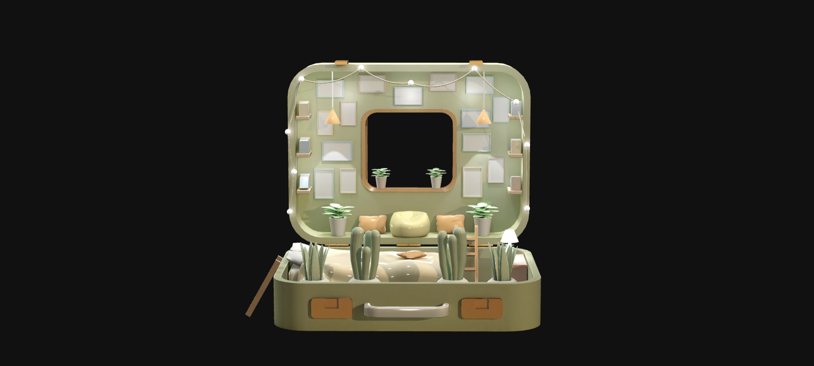

<div align="center">

</div>

# 🏠 Suitcase House — Interactive 3D Diorama Experience

A visually immersive **Three.js-powered 3D diorama** that transforms a miniature home environment into an interactive web experience.


---

## ✨ Overview

Suitcase House is an interactive 3D web experience built with Three.js that showcases a miniature home diorama rendered directly in the browser.

- Real-time WebGL rendering
- GLTF 3D model loading
- Physically based materials
- Baked textures
- Ambient and directional lighting
- Interactive camera controls
- Responsive viewport adaptation

---

## 🚀 Features

### 🎮 Interactive Controls

- Orbit camera navigation
- Smooth damping effects
- Zoom support
- Pan functionality
- Camera distance constraints

### 🏠 Realistic Diorama Scene

- Detailed 3D home environment
- High-quality baked textures
- Ambient occlusion maps
- Normal mapping for enhanced realism

### 💡 Advanced Lighting Setup

- Multiple directional light sources
- Rectangular area lighting
- Balanced illumination for depth and realism

### 📱 Responsive Design

- Automatic viewport resizing
- Optimized rendering resolution
- Cross-device compatibility

---

## 🛠️ Technology Stack

| Technology | Purpose |
|------------|---------|
| Three.js | 3D Rendering Engine |
| JavaScript (ES6) | Application Logic |
| GLTF Loader | 3D Asset Loading |
| Orbit Controls | Camera Interaction |
| WebGL | Graphics Rendering |
| CSS | Styling |

---

## 📂 Project Structure

```bash
Suitcase-House/
│
├── dist/
│   ├── index.html
│   ├── script.js
│   ├── style.css
│   
│
└── README.md
```

---

## ⚙️ Installation

```bash
git clone https://github.com/BinaryVortex/Suitcase-House.git
cd Suitcase-House
```

Run a local server:

```bash
npx serve .
```

or

```bash
python -m http.server 8000
```

---

## 🎨 Technical Highlights

- GLTF model loading
- Baked texture optimization
- WebGL rendering pipeline
- Responsive camera controls
- Real-time 3D interaction

---

## 🔮 Future Improvements

- HDRI environment lighting
- Animated scene elements
- Interactive hotspots
- Virtual walkthrough mode
- Mobile gesture enhancements

---

## 🤝 Contributing

1. Fork the repository
2. Create a feature branch
3. Commit your changes
4. Push to your fork
5. Open a Pull Request

---

## ⭐ Support

If you found this project useful, consider giving it a star on GitHub.

---

## 👨‍💻 Author

**BinaryVortex**

Crafting interactive web experiences through creativity, design, and code.
